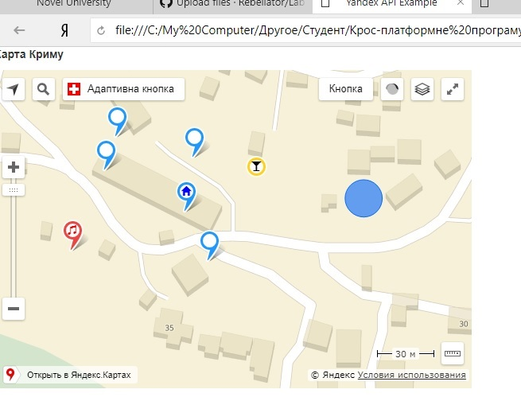

# Lab1
Yandex API

## Опис
В даній реалізації карти були використані такі функції:
1) Мітка для карти. При наведенні курсору відображається текст Hint, при
натисканні виводиться рамка з текстом Balloon.
2) Статична та адаптивна кнопка. Адаптивна кнопка змінює послідовно
свій розмір кожну секунду.
3) Гліф-іконки за допомогою набору шаблонів Bootstrap 3. Обрано іконки
“музика”, “дім”, “бар”.
4) Три мітки та коло з функцією переміщення при затисканні лівою
кнопкою миші. При потраплянні однієї з трьох міток в площину кола
колір даної мітки змінюється на червоний.

## Скріни

